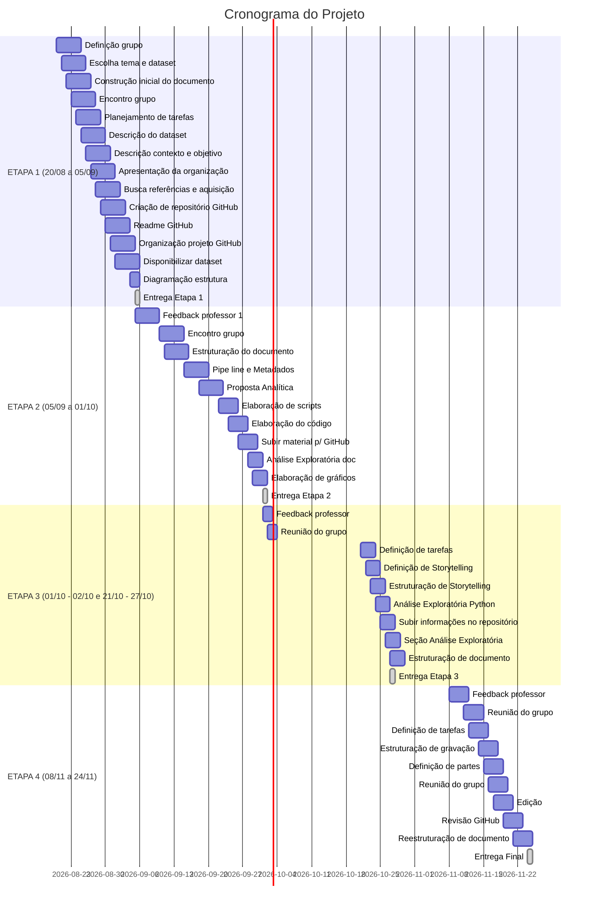

# Cronograma do Projeto

---

## ETAPA 1 – Planejamento Inicial

**Período Total: 20/08 a 05/09**

| Período | Atividades | Responsável |
| :---: | :--- | :---: |
| 20/08 - 22/08 | Definição grupo | Todos |
| 20/08 - 23/08 | Escolha tema e dataset | Ana Heloiza |
| 24/08 | Construção inicial do documento | Diógnes / Hudson |
| 25/08 | Encontro grupo | Todos |
| 26/08 - 27/08 | Planejamento de tarefas | Laura |
| 28/08 | Descrição do dataset | Hudson |
| 28/08 - 29/08 | Descrição do contexto e objetivo do projeto | Diógnes / Ana Heloiza |
| 30/08 | Apresentação da organização escolhida | Ana Heloiza |
| 30/08 - 31/08 | Busca por referências e aquisição de dados | Diógnes / Laura |
| 01/09 | Criação de repositório GitHub | Hudson |
| 01/09 | Readme GitHub | Laura |
| 02/09 | Organização projeto do GitHub | Diógnes / Hudson |
| 03/09 | Disponibilizar dataset no GitHub | Ana Heloiza |
| 04/09 | Estruturação do documento | Laura |
| 05/09 | **Entrega** | **Todos** |

## ETAPA 2 – Análise Exploratória

**Período Total: 05/09 a 01/10**

| Período | Atividades | Responsável |
| :---: | :--- | :---: |
| 05/09 - 09/09 | Feedback professor 1 | Todos |
| 10/09 | Encontro grupo | Todos |
| 11/09 - 14/09 | Estruturação do documento | Laura |
| 15/09 - 17/09 | Pipe line e Metadados | Laura |
| 18/09 - 21/09 | Proposta Analítica | Laura |
| 22/09 - 23/09 | Elaboração de scripts | Laura |
| 24/09 - 25/09 | Elaboração do código | Laura|
| 26/09 - 27/09 | Subir material elaborado para o GitHub | Laura |
| 28/09 | Análise Exploratória do documento | Laura |
| 01/10 | **Entrega** | Laura |

## ETAPA 3 – Storytelling

**Período Total: 01/10 - 02/10 a 27/10**

| Período | Atividades | Responsável |
| :---: | :--- | :---: |
| 01/10 | Feedback professor | Todos |
| 02/10 | Reunião do grupo | Todos |
| 21/10 | Definição de tarefas | Hudson |
| 21/10 - 22/10 | Definição de Storytelling | Laura |
| 23/10 | Estruturação de Storytelling | Diógnes / Ana Heloiza |
| 23/10 - 24/10 | Análise Exploratória em Python | Ana Heloiza |
| 25/10 | Subir informações no repositório | Diógnes / Hudson |
| 26/10 | Seção de Análise Exploratória inserida no Documento | Laura |
| 27/10 | Estruturação de documento | Diógnes / Laura |
| 27/10 | **Entrega** | **Todos** |

## ETAPA 4 – Encerramento

**Período Total: 08/11 a 24/11**

| Período | Atividades | Responsável |
| :---: | :--- | :---: |
| 08/11 - 10/11 | Feedback professor | Todos |
| 11/11 | Reunião do grupo | Todos |
| 12/11 - 13/11 | Definição de tarefas | Diógnes / Hudson |
| 14/11 | Estruturação de material para gravação | Laura |
| 15/11 | Definição de partes para gravação | Ana Heloiza |
| 16/11 | Reunião do grupo | Todos |
| 17/11 - 18/11 | Edição | Hudson |
| 19/11 - 20/11 | Revisão GitHub | Diógnes / Laura |
| 21/11 - 23/11 | Reestruturação de documento | Ana Heloiza |
| 24/11 | **Entrega Final** | **Todos** |

## Linha do Tempo

